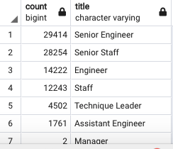
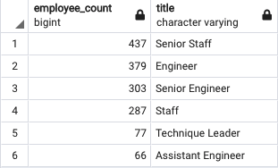

# Pewlett-Hackard-Analysis
Employee Database with SQL-Module 7
## Overview

The purpose of this report is to provide detailed analyses of the employees eligible for retirement from PH and help PH plan for this 'Silver Tsunami'. The report includes the number of titles that will be retiring, the number of retiring employees from each department and the number of eligible titles for the mentorship program.

## Results

* From the retiring_titles table, we can see that the titles eligible for retirement are : 'Senior Engineer', 'Senior Staff', 'Engineer', 'Staff', 'Technique Leader', 'Assistant Engineer' and 'Manager'.
* The total number of employees retiring is 90,398.

* The highest number among the retiring titles belong to 'Senior Engineers' : 29,414.
* There are only 2 managers eligible for retiring.
* The table below displays the number of titles eligible for the 'mentorship program'.

* The total number of employees eligible for the mentorship program is 1,549.
* The number of senior staff eligible for the mentorship program is the highest among all the titles : 437.
* The number of assisstant engineers eligible for the program is the least among all the titles : 66.

## Summary

* The unique titles table that we have determined in Deliverable 1, actually has some employees that have already left PH. 
* For example : emp_no = 10073, Shir McClurg, Engineer. This employee has left PH in 2/22/1998. 
* In order to obtain a more accurate table with unique titles that still work at PH, we need to filter the data with (to_date='9999-01-01'). 
* The table below shows the number of unique titles eligible for retiring and that still work at PH.

* The total number of employees eligible for retiring is 72,458.PH will need to hire new employees for these positions.
* Senior Engineers still make up the highest number of titles eligible for retirement.
* There are still 2 managers eligible for retirement.
* The table below shows the number of titles that are not eligible for retirement.

From the table we can see that the total number of titles PH has other that the ones eligible for retirement is 167,666. The number of engineers not eligible for retirement is 21,698. The number of engineers eligible for the mentoship program is only 379. Similarly, when we compare senior engineers, there are 60,023 senior engineers renaining at PH while only 303 eligible for the program. 

We can also see that there are no managers available for the mentorship program while 2 of the managers are eligible for retirement (please see Adjusted Retiring Titles Table). This leaves only 7 managers remaining at PH as we can see from the table above. P

PH has a large number of employees eligible for retirement and not enough employees available for mentorship to train the remaining employees. 
